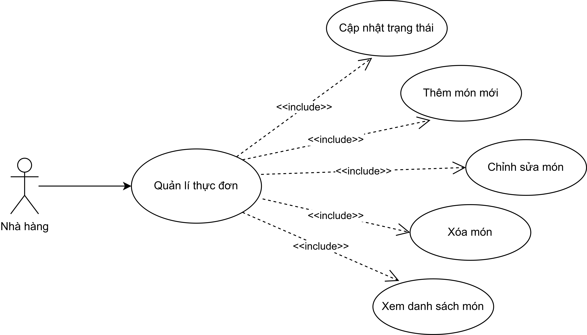
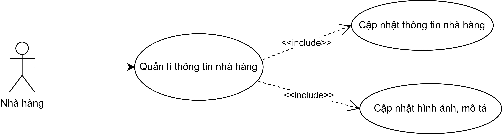
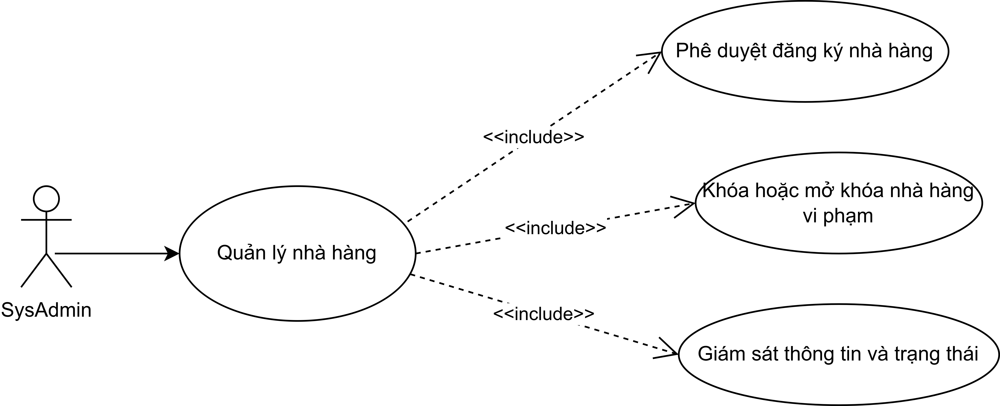

# FoodFast - FE Delivery (React.js + React Native)

## Mục tiêu

Ứng dụng **đặt món ăn trực tuyến** gồm:

* **Web**: giao diện React.js (cho người dùng đặt món).
* **Mobile**: giao diện React Native (cho người dùng đặt món và theo dõi đơn hàng).
* Dự án chỉ gồm **Frontend**, sử dụng **Mock data (JSON)** thay cho Backend.

---

## Sprint 1 (Tuần 1)

**Mục tiêu:** Hoàn thiện cấu trúc dự án + PRD + giao diện Login và Home (Web).

### Công việc Sprint 1

* \[ ] Viết PRD (Product Requirement Document)
* \[ ] Thiết kế bố cục giao diện (FE\_Design)
* \[ ] Tạo Mock Data (restaurants, products)
* \[ ] Xây dựng trang Login (React.js)
* \[ ] Xây dựng trang Home hiển thị danh sách nhà hàng (React.js)

---

## Cấu trúc thư mục

* `/web` → Giao diện React.js
* `/mobile` → Giao diện React Native
* `/docs` → Tài liệu PRD, Design, Test
* `/assets` → Ảnh, mock data, screenshot
* `/.github` → Template issue, PR

---

## Công nghệ

* React.js (Vite)
* React Native (Expo)
* Redux Toolkit (quản lý state)
* CSS Modules / TailwindCSS (tùy chọn)

---

## Cách chạy dự án

### Web

```bash
cd web
npm install
npm run dev
```

### Mobile

```bash
cd mobile
npm install
expo start
```

## Thành viên

| Họ tên           | MSSV       |
| ---------------- | ---------- |
| Phạm Thanh Phong | 3122411151 |
| Trần Hữu Nam     | 3122411131 |

## Tài liệu

| Tài liệu                                      | Mô tả                     |
| --------------------------------------------- | ------------------------- |
| \[PRD\_FE\_FoodFast.md](docs/PRD\_FE\_FoodFast.md) | Tài liệu yêu cầu sản phẩm |
| \[FE\_Design.md](docs/FE\_Design.md)             | Mô tả thiết kế giao diện  |
| \[Test\_Scenarios.md](docs/Test\_Scenarios.md)   | Kịch bản kiểm thử         |

## Tiến độ

* 2025-10-05: Khởi tạo repo + tạo cấu trúc thư mục + viết README.

## Use case





